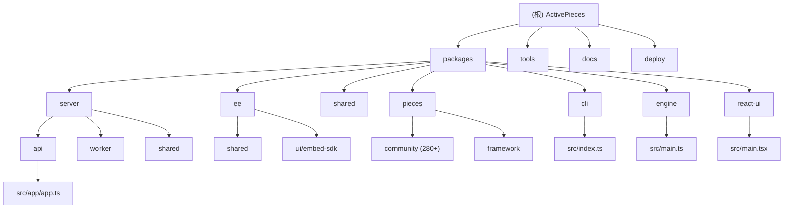

# ActivePieces - 项目架构文档

> **变更记录 (Changelog)**
> - 2025-11-18 16:06:33 - 第五次增量更新：补充API路由、OAuth应用管理、功能开关系统、工作队列机制和前端组件架构的详细分析
> - 2025-11-18 15:59:51 - 第四次增量更新：补充Webhook管理、用户管理、计费管理和引擎服务的深度分析
> - 2025-11-18 15:45:17 - 第三次增量更新：补充AI集成管理和平台管理功能的深度分析
> - 2025-11-18 15:28:53 - 第二次增量更新：补充企业版功能和流程管理的详细分析
> - 2025-11-18 15:10:43 - 初始化架构分析文档，生成完整项目概览

## 项目愿景

ActivePieces 是一个开源的 AI 驱动自动化平台，作为 Zapier 的替代方案，旨在为开发者和非技术用户提供直观、强大的工作流自动化体验。其核心特色包括：

- **开源生态系统**：60% 的集成由社区贡献，所有代码开放可审查
- **类型安全的集成框架**：基于 TypeScript 的 npm 包式集成开发
- **AI 优先设计**：内置 AI 集成，支持多种 AI 提供商
- **企业级就绪**：支持自托管、品牌定制和权限控制
- **MCP 工具包**：280+ 集成可作为 MCP 服务器与 LLM 交互

## 架构总览

### 技术栈
- **后端**: Node.js + TypeScript + Fastify + TypeORM
- **前端**: React + TypeScript + Vite + Tailwind CSS
- **数据库**: PostgreSQL + Redis
- **消息队列**: BullMQ
- **执行引擎**: V8 Isolate + WebSocket
- **构建系统**: Nx Monorepo

### 部署模式
- **社区版**: 完全开源，基础功能
- **企业版**: SSO、审计、多租户等企业功能
- **云版**: 托管服务，全功能

## ✨ 模块结构图



## 模块索引

| 模块 | 职责 | 关键技术 | 状态 |
|------|------|----------|------|
| [cli](packages/cli/) | 命令行工具 | Commander.js, TypeScript | 🟢 稳定 |
| [engine](packages/engine/) | 流程执行引擎 | V8 Isolate, WebSocket | 🟢 稳定 |
| [shared](packages/shared/) | 共享类型和工具 | TypeScript | 🟢 稳定 |
| [server](packages/server/) | 后端服务 | Fastify, TypeORM | 🟢 稳定 |
| [react-ui](packages/react-ui/) | 前端界面 | React, Vite, Tailwind | 🟢 稳定 |
| [ee](packages/ee/) | 企业版功能 | TypeScript | 🟡 开发中 |
| [pieces](packages/pieces/) | 集成模块 | TypeScript | 🟢 稳定 |

### 核心模块说明

#### CLI 工具 (`packages/cli`)
负责开发者和用户操作的命令行接口，包括：
- 集成开发：`pieces create`, `actions create`, `triggers create`
- 构建发布：`pieces build`, `pieces publish`
- 同步管理：`pieces sync`, `workers generate-token`

#### 执行引擎 (`packages/engine`)
流程执行的核心引擎，特点：
- **沙箱执行**：使用 V8 Isolate 安全隔离代码执行
- **实时通信**：通过 WebSocket 与主进程通信
- **变量处理**：支持复杂的变量解析和数据转换
- **错误处理**：完善的错误捕获和报告机制

#### 服务端 (`packages/server`)
基于 Fastify 的模块化后端架构：
- **API 服务**：RESTful API 和 WebSocket 服务
- **数据库**：PostgreSQL + TypeORM 数据持久化
- **队列系统**：BullMQ 处理异步任务
- **安全认证**：JWT、OAuth2、SAML 等认证机制

#### 前端界面 (`packages/react-ui`)
现代化的 React 应用：
- **可视化编辑器**：拖拽式流程构建
- **实时协作**：WebSocket 实时更新
- **国际化**：多语言支持
- **响应式设计**：支持桌面和移动端

#### 集成生态 (`packages/pieces`)
丰富的第三方服务集成：
- **框架支持**：标准化的集成开发框架
- **社区贡献**：280+ 社区维护的集成
- **MCP 支持**：可作为 MCP 服务器使用
- **热重载**：开发时实时预览功能

## 🔗 Webhook管理系统

ActivePieces 提供完整的 Webhook 管理和自动化处理机制，支持同步和异步两种执行模式，确保外部系统能够可靠地触发自动化流程。

### Webhook处理架构

#### 核心组件
```typescript
interface WebhookService {
  handleWebhook(params: HandleWebhookParams): Promise<EngineHttpResponse>;
}

enum WebhookFlowVersionToRun {
  LOCKED_FALL_BACK_TO_LATEST = 'locked_fall_back_to_latest',
  LATEST = 'latest',
}
```

#### Webhook服务特性
- **双模式支持**：同步和异步执行模式
- **版本控制**：支持锁定版本或最新版本执行
- **握手协议**：支持Webhook握手验证机制
- **错误处理**：完善的错误恢复和重试机制

### Webhook处理流程

#### 请求处理链
```typescript
// Webhook处理完整流程
1. 请求接收 → 验证流程存在性
2. 握手处理 → 如果是握手请求，返回握手响应
3. 模式判断 → 同步或异步执行
4. 队列处理 → 异步模式加入任务队列
5. 实时执行 → 同步模式立即执行并等待结果
6. 响应返回 → 统一的响应格式
```

#### 同步vs异步模式
**同步模式**：
- 立即执行流程并返回结果
- 支持实时响应和状态回调
- 适用于需要即时反馈的场景
- 超时机制防止长时间阻塞

**异步模式**：
- 快速返回确认响应
- 后台异步执行流程
- 适用于高并发和长时间运行的任务
- 支持批量处理和负载均衡

### Webhook握手机制

#### 握手策略
```typescript
enum WebhookHandshakeStrategy {
  HEADER_PRESENT = 'header_present',
  QUERY_PRESENT = 'query_present',
  BODY_PARAM_PRESENT = 'body_param_present',
}
```

#### 握手配置
```typescript
interface WebhookHandshakeConfiguration {
  strategy: WebhookHandshakeStrategy;
  paramName: string;  // 参数名称
}
```

#### 握手处理流程
1. **请求检测**：根据配置策略检测握手参数
2. **触发器执行**：调用对应触发器的握手逻辑
3. **响应生成**：返回握手响应或继续正常流程
4. **状态更新**：更新触发器状态和配置

### Webhook安全与监控

#### 安全特性
- **请求验证**：验证请求来源和格式
- **权限检查**：基于项目和流程的访问控制
- **参数过滤**：过滤恶意或无效参数
- **频率限制**：防止恶意请求和DDoS攻击

#### 监控指标
- **请求统计**：接收、处理、成功、失败计数
- **响应时间**：平均响应时间和性能监控
- **错误率**：错误类型和频率分析
- **吞吐量**：并发处理能力监控

## 👥 用户管理系统

ActivePieces 提供完整的用户生命周期管理，支持企业级的用户权限控制和多租户架构。

### 用户实体模型

#### 用户数据结构
```typescript
interface User {
  id: string;
  identityId: string;
  platformId: string;
  platformRole: PlatformRole;
  status: UserStatus;
  externalId?: string;
  created: Date;
  updated: Date;
}

enum PlatformRole {
  ADMIN = 'ADMIN',
  MEMBER = 'MEMBER',
}

enum UserStatus {
  ACTIVE = 'ACTIVE',
  INACTIVE = 'INACTIVE',
  PENDING_VERIFICATION = 'PENDING_VERIFICATION',
}
```

#### 用户身份关联
```typescript
interface UserIdentity {
  id: string;
  email: string;
  firstName: string;
  lastName: string;
  password: string;  // 加密存储
  verified: boolean;
  created: Date;
  updated: Date;
}
```

### 用户服务功能

#### 核心用户操作
```typescript
interface UserService {
  // 用户创建
  create(params: CreateParams): Promise<User>;

  // 用户更新
  update(params: UpdateParams): Promise<UserWithMetaInformation>;

  // 用户查询
  list(params: ListParams): Promise<SeekPage<UserWithMetaInformation>>;
  get(params: IdParams): Promise<User | null>;
  getOrThrow(params: IdParams): Promise<User>;

  // 用户删除
  delete(params: DeleteParams): Promise<void>;

  // 元信息获取
  getMetaInformation(params: IdParams): Promise<UserWithMetaInformation>;
}
```

#### 用户查询与分页
```typescript
interface ListParams {
  platformId: PlatformId;
  externalId?: string;           // 外部系统ID
  cursorRequest: Cursor;         // 游标分页
  limit?: number;               // 每页数量
}

// 支持的查询方式
- 按平台ID查询用户列表
- 按外部ID精确匹配
- 游标分页支持大数据集
- 关联查询用户身份信息
```

### 用户权限与角色管理

#### 平台级权限
- **平台管理员**：管理整个平台，包括用户、项目、配置
- **平台成员**：基础用户权限，可访问分配的项目

#### 项目级权限
- **项目所有者**：创建和管理项目
- **项目管理员**：管理项目成员和设置
- **项目编辑者**：编辑和执行流程
- **项目查看者**：只读访问权限

#### 权限检查机制
```typescript
// 权限验证示例
const user = await userService.getOrThrow({ id: userId });
const hasPermission = await checkProjectPermission(
  user.id,
  projectId,
  Permission.READ_PROJECT
);
if (!hasPermission) {
  throw new ActivepiecesError({
    code: ErrorCode.PERMISSION_DENIED,
  });
}
```

### 用户生命周期管理

#### 用户状态流转
```
PENDING_VERIFICATION → ACTIVE → INACTIVE
        ↓                 ↓
    (删除账户)        (重新激活)
```

#### 用户操作审计
- **创建记录**：记录用户创建时间和来源
- **登录日志**：记录用户登录时间和IP地址
- **权限变更**：记录角色和权限变更历史
- **状态变更**：记录用户状态变更原因

### 外部系统集成

#### 外部ID映射
```typescript
interface GetByPlatformAndExternalIdParams {
  platformId: string;
  externalId: string;  // 外部系统的用户标识
}

// 支持与外部系统的用户映射
- SSO系统用户同步
- LDAP目录集成
- 第三方身份提供商映射
- 企业HR系统集成
```

#### 用户数据同步
- **批量导入**：支持CSV、JSON格式的用户批量导入
- **实时同步**：通过Webhook实时同步用户变更
- **增量更新**：只同步变更的用户信息
- **冲突解决**：处理重复和冲突的用户数据

## 💰 计费管理系统

ActivePieces 提供完整的商业化计费管理功能，支持多种订阅模式、资源配额管理和使用量计费。

### 订阅计划体系

#### 计划层次结构
```typescript
enum PlanName {
  FREE = 'free',
  PLUS = 'plus',
  BUSINESS = 'business',
  ENTERPRISE = 'enterprise',
}

const PLAN_HIERARCHY = {
  [PlanName.FREE]: 0,
  [PlanName.PLUS]: 1,
  [PlanName.BUSINESS]: 2,
  [PlanName.ENTERPRISE]: 3,
};
```

#### 计划配置详情

**免费计划 (FREE)**：
```typescript
FREE_CLOUD_PLAN: PlatformPlanWithOnlyLimits = {
  plan: 'free',
  includedAiCredits: 200,
  aiCreditsOverageState: AiOverageState.NOT_ALLOWED,
  activeFlowsLimit: 10,
  userSeatsLimit: 1,
  projectsLimit: 1,
  tablesLimit: 1,
  mcpLimit: 1,

  // 基础功能
  agentsEnabled: true,
  tablesEnabled: true,
  todosEnabled: true,
  mcpsEnabled: true,

  // 高级功能禁用
  embeddingEnabled: false,
  globalConnectionsEnabled: false,
  customRolesEnabled: false,
  // ... 更多企业功能禁用
}
```

**Plus计划 (PLUS)**：
```typescript
PLUS_CLOUD_PLAN: PlatformPlanWithOnlyLimits = {
  plan: 'plus',
  includedAiCredits: 500,
  aiCreditsOverageState: AiOverageState.ALLOWED_BUT_OFF,
  activeFlowsLimit: 10,
  userSeatsLimit: 1,
  projectsLimit: 1,

  // 解除部分限制
  mcpLimit: undefined,
  tablesLimit: undefined,
}
```

**商业计划 (BUSINESS)**：
```typescript
BUSINESS_CLOUD_PLAN: PlatformPlanWithOnlyLimits = {
  plan: 'business',
  includedAiCredits: 1000,
  activeFlowsLimit: 50,
  userSeatsLimit: 5,
  projectsLimit: 10,

  // 企业级功能
  analyticsEnabled: true,
  manageProjectsEnabled: true,
  projectRolesEnabled: true,
  apiKeysEnabled: true,
  ssoEnabled: true,
}
```

### 计费周期管理

#### 计费周期
```typescript
enum BillingCycle {
  MONTHLY = 'monthly',
  ANNUAL = 'annual',
}

const BILLING_CYCLE_HIERARCHY = {
  [BillingCycle.MONTHLY]: 0,
  [BillingCycle.ANNUAL]: 1,
};
```

#### 定价策略
```typescript
// 附加资源定价
const PRICE_PER_EXTRA_USER_MAP = {
  [BillingCycle.ANNUAL]: 11.4,    // 年付折扣
  [BillingCycle.MONTHLY]: 15,     // 月付价格
};

const PRICE_PER_EXTRA_PROJECT_MAP = {
  [BillingCycle.ANNUAL]: 7.6,
  [BillingCycle.MONTHLY]: 10,
};

const PRICE_PER_EXTRA_5_ACTIVE_FLOWS_MAP = {
  [BillingCycle.ANNUAL]: 11.4,
  [BillingCycle.MONTHLY]: 15,
};
```

### 资源配额管理

#### 配额指标映射
```typescript
const METRIC_TO_LIMIT_MAPPING = {
  [PlatformUsageMetric.ACTIVE_FLOWS]: 'activeFlowsLimit',
  [PlatformUsageMetric.USER_SEATS]: 'userSeatsLimit',
  [PlatformUsageMetric.PROJECTS]: 'projectsLimit',
  [PlatformUsageMetric.TABLES]: 'tablesLimit',
  [PlatformUsageMetric.MCPS]: 'mcpLimit',
};

const METRIC_TO_USAGE_MAPPING = {
  [PlatformUsageMetric.ACTIVE_FLOWS]: 'activeFlows',
  [PlatformUsageMetric.USER_SEATS]: 'seats',
  [PlatformUsageMetric.PROJECTS]: 'projects',
  [PlatformUsageMetric.TABLES]: 'tables',
  [PlatformUsageMetric.MCPS]: 'mcps',
};
```

#### 配额检查机制
```typescript
// 配额检查示例
await PlatformPlanHelper.checkQuotaOrThrow({
  platformId: params.platformId,
  metric: PlatformUsageMetric.PROJECTS,
});

// 支持的配额类型
enum PlatformUsageMetric {
  ACTIVE_FLOWS = 'active_flows',
  USER_SEATS = 'user_seats',
  PROJECTS = 'projects',
  TABLES = 'tables',
  MCPS = 'mcps',
}
```

### AI积分管理

#### AI积分系统
```typescript
enum AiOverageState {
  NOT_ALLOWED = 'not_allowed',      // 不允许超额
  ALLOWED_BUT_OFF = 'allowed_but_off', // 允许但未开启
  ENABLED = 'enabled',              // 已开启超额计费
}

const AI_CREDITS_USAGE_THRESHOLD = 15000;  // 使用量阈值
```

#### AI积分配置
- **包含积分**：每个计划包含的基础AI积分
- **超额限制**：是否允许AI积分超额使用
- **计费机制**：超额使用的计费方式
- **使用追踪**：精确的积分使用量追踪

### Stripe集成

#### 价格ID配置
```typescript
const PRICE_ID_MAP = {
  [PRICE_NAMES.PLUS_PLAN]: {
    [BillingCycle.MONTHLY]: {
      dev: 'price_1RTRd4QN93Aoq4f8E22qF5JU',
      prod: 'price_1RflgUKZ0dZRqLEK5COq9Kn8',
    },
    [BillingCycle.ANNUAL]: {
      dev: 'price_1RtZrSQN93Aoq4f8KLZq4yif',
      prod: 'price_1RtZwlKZ0dZRqLEKBiPradv4',
    },
  },
  // ... 更多价格配置
};
```

#### 订阅管理
```typescript
interface CreateSubscriptionParams {
  plan: PlanName.PLUS | PlanName.BUSINESS;
  cycle: BillingCycle;
  addons: {
    userSeats?: number;
    activeFlows?: number;
    projects?: number;
  };
}

interface UpdateSubscriptionParams {
  plan: PlanName.FREE | PlanName.PLUS | PlanName.BUSINESS;
  addons: Addons;
  cycle: BillingCycle;
}
```

### AppSumo集成

#### AppSumo计划配置
```typescript
const APPSUMO_PLAN = ({
  planName,
  userSeatsLimit,
  tablesLimit,
  mcpLimit
}: {
  planName: string;
  userSeatsLimit: number;
  tablesLimit: number;
  mcpLimit: number;
}): PlatformPlanWithOnlyLimits => {
  return {
    plan: planName,
    userSeatsLimit,
    includedAiCredits: 200,
    aiCreditsOverageState: AiOverageState.ALLOWED_BUT_OFF,
    projectsLimit: 1,
    mcpLimit,
    tablesLimit,

    // AppSumo特色功能
    projectRolesEnabled: true,
  };
};
```

#### AppSumo层级管理
```typescript
const PLAN_HIERARCHY = {
  // 标准计划
  [PlanName.FREE]: 0,
  [PlanName.PLUS]: 1,
  [PlanName.BUSINESS]: 2,
  [PlanName.ENTERPRISE]: 3,

  // AppSumo计划
  [PlanName.APPSUMO_ACTIVEPIECES_TIER1]: 0,
  [PlanName.APPSUMO_ACTIVEPIECES_TIER2]: 0,
  [PlanName.APPSUMO_ACTIVEPIECES_TIER3]: 1,
  [PlanName.APPSUMO_ACTIVEPIECES_TIER4]: 2,
  [PlanName.APPSUMO_ACTIVEPIECES_TIER5]: 3,
  [PlanName.APPSUMO_ACTIVEPIECES_TIER6]: 4,  // 最高级
};
```

## ⚙️ 触发器管理系统

ActivePieces 提供强大的触发器管理系统，支持多种触发类型、调度管理和事件处理机制。

### 触发器架构

#### 触发器模块结构
```typescript
// 触发器模块注册
export const triggerModule: FastifyPluginAsyncTypebox = async (app) => {
  await app.register(testTriggerController, { prefix: '/v1/test-trigger' });
  await app.register(triggerEventController, { prefix: '/v1/trigger-events' });
  await app.register(triggerRunController, { prefix: '/v1/trigger-runs' });
};
```

#### 触发器类型
- **Webhook触发器**：接收外部HTTP请求触发
- **调度触发器**：基于时间计划的定时触发
- **轮询触发器**：定期检查外部系统状态变化
- **事件触发器**：监听系统内部事件

### 触发器源管理

#### 触发器源实体
```typescript
interface TriggerSource {
  id: string;
  type: string;
  projectId: string;
  flowId: string;
  triggerName: string;
  flowVersionId: string;
  pieceName: string;
  pieceVersion: string;
  simulate: boolean;
  schedule?: ScheduleOptions;
  created: Date;
  updated: Date;
}
```

#### 触发器生命周期
```typescript
interface TriggerSourceService {
  // 启用触发器
  enable(params: EnableTriggerParams): Promise<TriggerSource>;

  // 禁用触发器
  disable(params: DisableTriggerParams): Promise<void>;

  // 查询触发器
  get(params: GetTriggerParams): Promise<TriggerSource | null>;
  getByFlowId(params: GetFlowIdParams): Promise<TriggerSource | null>;
  getByFlowIdPopulated(params: GetByFlowIdParams): Promise<PopulatedTriggerSource | null>;

  // 状态检查
  existsByFlowId(params: ExistsByFlowIdParams): Promise<boolean>;
}
```

### 触发器启用流程

#### 启用触发器步骤
```typescript
async enable(params: EnableTriggerParams): Promise<TriggerSource> {
  const { flowVersion, projectId, simulate } = params;

  // 1. 获取Piece触发器定义
  const pieceTrigger = await triggerUtils(log)
    .getPieceTriggerOrThrow({ flowVersion, projectId });

  // 2. 清理现有触发器
  await triggerSourceRepo().softDelete({
    flowId: flowVersion.flowId,
    projectId,
    simulate,
  });

  // 3. 创建新触发器源
  const triggerSource = await triggerSourceRepo().save({
    id: apId(),
    type: pieceTrigger.type,
    projectId,
    flowId: flowVersion.flowId,
    triggerName: pieceTrigger.name,
    flowVersionId: flowVersion.id,
    pieceName: flowVersion.trigger.settings.pieceName,
    pieceVersion: flowVersion.trigger.settings.pieceVersion,
    simulate,
  });

  // 4. 设置触发器副作用（调度、轮询等）
  const { scheduleOptions } = await flowTriggerSideEffect(log).enable({
    flowVersion,
    projectId,
    pieceName: flowVersion.trigger.settings.pieceName,
    pieceTrigger,
    simulate,
  });

  // 5. 保存完整配置
  return triggerSourceRepo().save({
    ...triggerSource,
    schedule: scheduleOptions,
  });
}
```

### 触发器测试

#### 测试触发器控制器
```typescript
// 测试触发器功能
- 模拟触发器执行
- 验证触发器配置
- 获取测试数据
- 调试触发器问题
```

#### 触发器事件管理
```typescript
// 触发器事件处理
- 事件接收和验证
- 事件格式转换
- 事件路由和分发
- 事件历史记录
```

### 触发器运行管理

#### 触发器运行控制
```typescript
// 触发器运行控制器
- 手动触发执行
- 运行状态监控
- 运行历史查询
- 错误处理和重试
```

#### 去重服务
```typescript
// 触发器去重机制
- 防止重复触发
- 基于内容的去重
- 时间窗口去重
- 去重配置管理
```

## 📁 文件管理系统

ActivePieces 提供完整的文件管理功能，支持多种存储后端、文件压缩和生命周期管理。

### 文件存储架构

#### 存储位置策略
```typescript
enum FileLocation {
  DB = 'db',      // 数据库存储
  S3 = 's3',      // S3对象存储
}

function getLocationForFile(type: FileType): FileLocation {
  const FILE_LOCATION = system.getOrThrow<FileLocation>(
    AppSystemProp.FILE_STORAGE_LOCATION
  );

  // 过期文件使用配置的存储位置
  if (isExecutionDataFileThatExpires(type)) {
    return FILE_LOCATION;
  }

  // 永久文件存储在数据库
  return FileLocation.DB;
}
```

#### 文件类型分类
```typescript
// 临时文件（会过期）
function isExecutionDataFileThatExpires(type: FileType): boolean {
  switch (type) {
    case FileType.FLOW_RUN_LOG:
    case FileType.FLOW_STEP_FILE:
    case FileType.TRIGGER_PAYLOAD:
    case FileType.TRIGGER_EVENT_FILE:
      return true;

    // 永久文件
    case FileType.SAMPLE_DATA:
    case FileType.SAMPLE_DATA_INPUT:
    case FileType.PACKAGE_ARCHIVE:
    case FileType.PROJECT_RELEASE:
    case FileType.FLOW_VERSION_BACKUP:
      return false;
  }
}
```

### 文件服务功能

#### 核心文件操作
```typescript
interface FileService {
  // 保存文件
  save(params: SaveParams): Promise<File>;

  // 检查文件存在
  exists(params: GetOneParams): Promise<boolean>;

  // 获取文件
  getFile(params: GetOneParams): Promise<File | null>;
  getFileOrThrow(params: GetOneParams): Promise<File>;

  // 获取文件数据
  getDataOrThrow(params: GetOneParams): Promise<GetDataResponse>;
  getDataOrUndefined(params: GetOneParams): Promise<GetDataResponse | undefined>;

  // 批量清理过期文件
  deleteStaleBulk(types: FileType[]): Promise<void>;
}
```

#### 文件保存策略
```typescript
async save(params: SaveParams): Promise<File> {
  const baseFile: BaseFile = {
    id: params.fileId ?? apId(),
    projectId: params.projectId,
    platformId: params.platformId,
    type: params.type,
    fileName: params.fileName,
    compression: params.compression,
    size: params.size,
    metadata: params.metadata,
    created: dayjs().toISOString(),
    updated: dayjs().toISOString(),
  };

  const location = getLocationForFile(params.type);

  switch (location) {
    case FileLocation.DB:
      return saveFileToDb(baseFile, params.data);

    case FileLocation.S3:
      try {
        // 上传到S3
        const s3Key = await s3Helper(log).constructS3Key(
          params.platformId,
          params.projectId,
          params.type,
          baseFile.id
        );

        if (!isNil(params.data)) {
          await s3Helper(log).uploadFile(s3Key, params.data);
        }

        return await fileRepo().save({
          ...baseFile,
          location: FileLocation.S3,
          s3Key,
        });
      } catch (error) {
        // S3失败时回退到数据库存储
        exceptionHandler.handle(error, log);
        return saveFileToDb(baseFile, params.data);
      }
  }
}
```

### 文件压缩管理

#### 压缩策略
```typescript
enum FileCompression {
  NONE = 'none',
  GZIP = 'gzip',
}

// 文件压缩处理
interface FileCompressor {
  compress(data: Buffer, compression: FileCompression): Promise<Buffer>;
  decompress(data: Buffer, compression: FileCompression): Promise<Buffer>;
}
```

#### 压缩配置
- **GZIP压缩**：减少存储空间占用
- **自动压缩**：大于指定阈值的文件自动压缩
- **透明解压**：读取时自动解压，对用户透明
- **压缩比优化**：根据文件类型选择最佳压缩策略

### S3集成

#### S3辅助功能
```typescript
interface S3Helper {
  // 构建S3键
  constructS3Key(
    platformId: string,
    projectId: string,
    type: FileType,
    fileId: string
  ): Promise<string>;

  // 上传文件
  uploadFile(key: string, data: Buffer): Promise<void>;

  // 获取文件
  getFile(key: string): Promise<Buffer>;

  // 删除文件
  deleteFile(key: string): Promise<void>;

  // 批量删除
  deleteFiles(keys: string[]): Promise<void>;
}
```

#### S3配置示例
```typescript
// S3键格式：{platformId}/{projectId}/{type}/{fileId}
const s3Key = `${platformId}/${projectId}/${type}/${fileId}`;

// 支持的S3操作
- 文件上传和下载
- 批量删除操作
- 文件存在性检查
- 预签名URL生成
```

### 文件生命周期管理

#### 过期文件清理
```typescript
async deleteStaleBulk(types: FileType[]): Promise<void> {
  const retentionDateBoundary = dayjs()
    .subtract(EXECUTION_DATA_RETENTION_DAYS, 'days')
    .toISOString();

  const maximumFilesToDeletePerIteration = 4000;
  let totalAffected = 0;

  // 分批处理大量文件
  let affected: undefined | number = undefined;
  while (isNil(affected) || affected === maximumFilesToDeletePerIteration) {
    const staleFiles = await fileRepo().find({
      select: ['id', 'created', 's3Key'],
      where: {
        type: In(types),
        created: LessThanOrEqual(retentionDateBoundary),
      },
      take: maximumFilesToDeletePerIteration,
    });

    // 删除S3文件
    const s3Keys = staleFiles.filter(f => !isNil(f.s3Key)).map(f => f.s3Key!);
    await s3Helper(log).deleteFiles(s3Keys);

    // 删除数据库记录
    const result = await fileRepo().delete({
      type: In(types),
      created: LessThanOrEqual(retentionDateBoundary),
      id: In(staleFiles.map(file => file.id)),
    });

    affected = result.affected || 0;
    totalAffected += affected;
  }
}
```

#### 保留策略
- **执行数据**：根据配置的保留天数自动清理
- **日志文件**：定期清理旧的执行日志
- **临时文件**：任务完成后立即清理
- **备份文件**：长期保留重要备份

### 文件访问控制

#### 权限验证
```typescript
// 文件访问权限检查
- 项目级别访问控制
- 用户权限验证
- 文件类型权限检查
- API访问限制
```

#### 安全措施
- **路径验证**：防止路径遍历攻击
- **文件类型检查**：限制允许的文件类型
- **大小限制**：防止大文件攻击
- **访问日志**：记录文件访问历史

## 🔐 OAuth应用管理系统

ActivePieces 提供完整的 OAuth 应用管理功能，支持第三方服务集成和安全的客户端凭证管理。

### OAuth应用模型

#### OAuth应用实体
```typescript
export const OAuthApp = Type.Object({
  ...BaseModelSchema,
  pieceName: Type.String(),
  platformId: Type.String(),
  clientId: Type.String(),
});

export type OAuthApp = Static<typeof OAuthApp>;

export const UpsertOAuth2AppRequest = Type.Object({
  pieceName: Type.String(),
  clientId: Type.String(),
  clientSecret: Type.String(),
});

export type UpsertOAuth2AppRequest = Static<typeof UpsertOAuth2AppRequest>;
```

#### OAuth应用请求类型
```typescript
export const ListOAuth2AppRequest = Type.Object({
  limit: Type.Optional(Type.Number()),
  cursor: Type.Optional(Type.String()),
});

export type ListOAuth2AppRequest = Static<typeof ListOAuth2AppRequest>;
```

### OAuth应用服务

#### 核心功能实现
```typescript
export const oauthAppService = {
  // 创建或更新OAuth应用
  async upsert({
    platformId,
    request,
  }: {
    platformId: string;
    request: UpsertOAuth2AppRequest;
  }): Promise<OAuthApp> {
    await oauthRepo().upsert(
      {
        platformId,
        ...request,
        clientSecret: await encryptUtils.encryptString(request.clientSecret),
        id: apId(),
      },
      ['platformId', 'pieceName'],
    );

    const connection = await oauthRepo().findOneByOrFail({
      platformId,
      pieceName: request.pieceName,
    });

    return deleteProps(connection, ['clientSecret']);
  },

  // 获取包含密钥的OAuth应用
  async getWithSecret({
    platformId,
    pieceName,
    clientId,
  }: {
    platformId: string;
    pieceName: string;
    clientId?: string;
  }): Promise<OAuthAppWithSecret> {
    const oauthApp = await oauthRepo().findOneByOrFail({
      platformId,
      pieceName,
      clientId,
    });

    return {
      ...oauthApp,
      clientSecret: await encryptUtils.decryptString(oauthApp.clientSecret),
    };
  },

  // 列出OAuth应用
  async list({
    request,
    platformId,
  }: {
    platformId: string;
    request: ListOAuth2AppRequest;
  }): Promise<SeekPage<OAuthApp>> {
    const decodedCursor = paginationHelper.decodeCursor(request.cursor ?? null);
    const paginator = buildPaginator({
      entity: OAuthAppEntity,
      query: {
        limit: request.limit ?? 10,
        order: 'ASC',
        afterCursor: decodedCursor.nextCursor,
        beforeCursor: decodedCursor.previousCursor,
      },
    });

    const { data, cursor } = await paginator.paginate(
      oauthRepo().createQueryBuilder('oauth_app').where({ platformId }),
    );

    return paginationHelper.createPage<OAuthApp>(data, cursor);
  },

  // 删除OAuth应用
  async delete({
    platformId,
    id,
  }: {
    platformId: string;
    id: string;
  }): Promise<void> {
    const oauthApp = await oauthRepo().findOneBy({ platformId, id });
    if (isNil(oauthApp)) {
      throw new ActivepiecesError({
        code: ErrorCode.ENTITY_NOT_FOUND,
        params: {
          message: `OAuth with id ${id} not found`,
        },
      });
    }
    await oauthRepo().delete({ platformId, id });
  },
};
```

### OAuth应用安全特性

#### 客户端凭证管理
- **加密存储**：使用 AES-256 加密存储客户端密钥
- **权限隔离**：基于平台ID的凭证隔离
- **密钥轮换**：支持密钥的安全轮换
- **审计日志**：记录凭证的创建、更新、删除操作

#### 访问控制
```typescript
// OAuth应用访问权限检查
- 平台管理员权限验证
- 集成名称唯一性检查
- 客户端ID冲突检测
- 应用状态验证
```

#### 集成管理
- **动态配置**：支持运行时动态添加OAuth应用
- **批量管理**：支持批量导入和导出OAuth配置
- **版本控制**：支持OAuth配置的版本管理
- **测试功能**：支持OAuth连接的测试验证

## 🚦 功能开关系统

ActivePieces 提供强大的功能开关系统，支持动态配置、环境差异化管理和实时功能控制。

### 功能开关架构

#### 功能开关实体
```typescript
interface FlagEntity {
  id: string;
  value: any;  // JSONB 类型，支持复杂数据
  created: Date;
  updated: Date;
}
```

#### 功能开关服务
```typescript
export const flagService = {
  // 保存功能开关
  async save(flag: FlagType): Promise<Flag> {
    return flagRepo().save({
      id: flag.id,
      value: flag.value,
    });
  },

  // 获取单个功能开关
  async getOne(flagId: ApFlagId): Promise<Flag | null> {
    return flagRepo().findOneBy({ id: flagId });
  },

  // 获取所有功能开关
  async getAll(): Promise<Flag[]> {
    // ... 实现逻辑
  },
};
```

### 功能开关配置

#### 核心功能开关列表
```typescript
const flags = await flagRepo().findBy({
  id: In([
    ApFlagId.SHOW_POWERED_BY_IN_FORM,
    ApFlagId.CLOUD_AUTH_ENABLED,
    ApFlagId.CURRENT_VERSION,
    ApFlagId.EDITION,
    ApFlagId.EMAIL_AUTH_ENABLED,
    ApFlagId.EXECUTION_DATA_RETENTION_DAYS,
    ApFlagId.ENVIRONMENT,
    ApFlagId.PUBLIC_URL,
    ApFlagId.LATEST_VERSION,
    ApFlagId.PRIVACY_POLICY_URL,
    ApFlagId.PIECES_SYNC_MODE,
    ApFlagId.PRIVATE_PIECES_ENABLED,
    ApFlagId.FLOW_RUN_TIME_SECONDS,
    ApFlagId.SHOW_COMMUNITY,
    ApFlagId.SUPPORTED_APP_WEBHOOKS,
    ApFlagId.TELEMETRY_ENABLED,
    ApFlagId.TEMPLATES_PROJECT_ID,
    ApFlagId.TERMS_OF_SERVICE_URL,
    ApFlagId.THEME,
    ApFlagId.THIRD_PARTY_AUTH_PROVIDER_REDIRECT_URL,
    ApFlagId.THIRD_PARTY_AUTH_PROVIDERS_TO_SHOW_MAP,
    ApFlagId.SAML_AUTH_ACS_URL,
    ApFlagId.USER_CREATED,
    ApFlagId.WEBHOOK_URL_PREFIX,
    ApFlagId.ALLOW_NPM_PACKAGES_IN_CODE_STEP,
    ApFlagId.MAX_FIELDS_PER_TABLE,
    ApFlagId.MAX_RECORDS_PER_TABLE,
    ApFlagId.MAX_FILE_SIZE_MB,
  ]),
});
```

#### 动态功能开关
```typescript
// AI配置检查
{
  id: ApFlagId.AGENTS_CONFIGURED,
  value: await aiProviderService.isAgentConfigured(),
  created,
  updated,
},

// 告警显示控制
{
  id: ApFlagId.SHOW_ALERTS,
  value: system.getEdition() !== ApEdition.COMMUNITY,
  created,
  updated,
},

// 项目成员显示
{
  id: ApFlagId.SHOW_PROJECT_MEMBERS,
  value: system.getEdition() !== ApEdition.COMMUNITY,
  created,
  updated,
},
```

### 功能开关类型定义

#### 基础开关结构
```typescript
type BaseFlagStructure<K extends ApFlagId, V> = {
  id: K;
  value: V;
};

export type FlagType =
  | BaseFlagStructure<ApFlagId.PUBLIC_URL, string>
  | BaseFlagStructure<ApFlagId.TELEMETRY_ENABLED, boolean>
  | BaseFlagStructure<ApFlagId.USER_CREATED, boolean>
  | BaseFlagStructure<ApFlagId.WEBHOOK_URL_PREFIX, string>;
```

#### 功能开关枚举
```typescript
enum ApFlagId {
  // 基础配置
  SHOW_POWERED_BY_IN_FORM = 'SHOW_POWERED_BY_IN_FORM',
  CLOUD_AUTH_ENABLED = 'CLOUD_AUTH_ENABLED',
  EMAIL_AUTH_ENABLED = 'EMAIL_AUTH_ENABLED',

  // 版本信息
  CURRENT_VERSION = 'CURRENT_VERSION',
  LATEST_VERSION = 'LATEST_VERSION',

  // 系统配置
  ENVIRONMENT = 'ENVIRONMENT',
  PUBLIC_URL = 'PUBLIC_URL',
  TELEMETRY_ENABLED = 'TELEMETRY_ENABLED',

  // 功能控制
  PRIVATE_PIECES_ENABLED = 'PRIVATE_PIECES_ENABLED',
  SHOW_COMMUNITY = 'SHOW_COMMUNITY',
  ALLOW_NPM_PACKAGES_IN_CODE_STEP = 'ALLOW_NPM_PACKAGES_IN_CODE_STEP',

  // 资源限制
  MAX_FIELDS_PER_TABLE = 'MAX_FIELDS_PER_TABLE',
  MAX_RECORDS_PER_TABLE = 'MAX_RECORDS_PER_TABLE',
  MAX_FILE_SIZE_MB = 'MAX_FILE_SIZE_MB',

  // 主题和UI
  THEME = 'THEME',
  SHOW_TUTORIALS = 'SHOW_TUTORIALS',

  // AI功能
  AGENTS_CONFIGURED = 'AGENTS_CONFIGURED',
  CAN_CONFIGURE_AI_PROVIDER = 'CAN_CONFIGURE_AI_PROVIDER',

  // 企业功能
  SHOW_ALERTS = 'SHOW_ALERTS',
  SHOW_PROJECT_MEMBERS = 'SHOW_PROJECT_MEMBERS',
  SHOW_BILLING = 'SHOW_BILLING',

  // 执行配置
  FLOW_RUN_TIME_SECONDS = 'FLOW_RUN_TIME_SECONDS',
  FLOW_RUN_MEMORY_LIMIT_KB = 'FLOW_RUN_MEMORY_LIMIT_KB',
  PAUSED_FLOW_TIMEOUT_DAYS = 'PAUSED_FLOW_TIMEOUT_DAYS',
  WEBHOOK_TIMEOUT_SECONDS = 'WEBHOOK_TIMEOUT_SECONDS',

  // 同步模式
  ENABLE_FLOW_ON_PUBLISH = 'ENABLE_FLOW_ON_PUBLISH',
  EXECUTION_DATA_RETENTION_DAYS = 'EXECUTION_DATA_RETENTION_DAYS',

  // Webhook配置
  WEBHOOK_URL_PREFIX = 'WEBHOOK_URL_PREFIX',
  SUPPORTED_APP_WEBHOOKS = 'SUPPORTED_APP_WEBHOOKS',
}
```

### 功能开关使用场景

#### 版本控制
- **当前版本**：显示当前运行的版本号
- **最新版本**：检查可用的最新版本
- **版本对比**：提供版本升级提示

#### 功能启用控制
- **AI功能**：控制AI相关功能的启用
- **社区功能**：控制社区内容的显示
- **私有集成**：控制私有集成的使用权限

#### 资源限制配置
- **表格限制**：控制表格的字段和记录数量限制
- **文件大小**：控制文件上传的大小限制
- **执行时间**：控制流程执行的超时时间

#### UI和主题控制
- **主题配置**：控制界面的主题样式
- **教程显示**：控制新手教程的显示
- **品牌显示**：控制品牌标识的显示

### 功能开关管理接口

#### 管理员接口
```typescript
// 更新功能开关
PUT /api/v1/admin/flags/:id
{
  "value": true
}

// 批量更新功能开关
PUT /api/v1/admin/flags/batch
{
  "flags": [
    { "id": "SHOW_COMMUNITY", "value": false },
    { "id": "ALLOW_NPM_PACKAGES_IN_CODE_STEP", "value": true }
  ]
}

// 重置功能开关到默认值
POST /api/v1/admin/flags/:id/reset
```

#### 查询接口
```typescript
// 获取所有功能开关
GET /api/v1/flags

// 获取特定功能开关
GET /api/v1/flags/:id

// 获取功能开关历史
GET /api/v1/flags/:id/history
```

## ⚙️ 工作队列机制

ActivePieces 采用强大的 BullMQ 工作队列系统，支持动态队列管理、优先级处理和分布式任务执行。

### 队列架构设计

#### 动态队列系统
```typescript
export const jobQueue = (log: FastifyBaseLogger) => ({
  async init(): Promise<void> {
    const platformIdsWithDedicatedWorkers = await dedicatedWorkers(log).getPlatformIds();

    await Promise.all([
      // 为每个启用专用工作者的平台创建独立队列
      ...platformIdsWithDedicatedWorkers.map(async (platformId) => {
        const queueName = await getQueueName(platformId, log);
        const queue = await ensureQueueExists({ log, queueName });
        dedicatedWorkersQueues.set(queueName, queue);
      }),
      // 创建共享的工作队列
      ensureQueueExists({ log, queueName: QueueName.WORKER_JOBS }),
    ]);

    log.info('[jobQueue#init] Dynamic queue system initialized');
  },
});
```

#### 队列创建策略
```typescript
async function ensureQueueExists({
  log,
  queueName
}: {
  log: FastifyBaseLogger,
  queueName: string
}): Promise<Queue> {
  const isOtpEnabled = system.getBoolean(AppSystemProp.OTEL_ENABLED);
  const queue = new Queue(queueName, {
    telemetry: isOtpEnabled ? new BullMQOtel(queueName) : undefined,
    connection: await redisConnections.create(),
    defaultJobOptions: {
      attempts: 5,
      backoff: {
        type: 'exponential',
        delay: EIGHT_MINUTES_IN_MILLISECONDS,
      },
      removeOnComplete: true,
      removeOnFail: {
        age: REDIS_FAILED_JOB_RETENTION_DAYS,
        count: REDIS_FAILED_JOB_RETRY_COUNT,
      },
    },
  });

  await queue.removeGlobalConcurrency();
  await queue.waitUntilReady();

  dedicatedWorkersQueues.set(queueName, queue);

  return queue;
}
```

### 任务类型管理

#### 任务类型定义
```typescript
export enum JobType {
  REPEATING = 'repeating',  // 重复任务
  ONE_TIME = 'one_time',    // 一次性任务
}

type BaseAddParams<JD extends Omit<JobData, 'engineToken'>, JT extends JobType> = {
  id: ApId;
  data: JD;
  type: JT;
  delay?: number;
};

type RepeatingJobAddParams = BaseAddParams<
  PollingJobData | RenewWebhookJobData,
  JobType.REPEATING
> & {
  scheduleOptions: ScheduleOptions;
};

type OneTimeJobAddParams = BaseAddParams<
  ExecuteFlowJobData | WebhookJobData | UserInteractionJobData,
  JobType.ONE_TIME
>;

export type AddJobParams<type extends JobType> =
  type extends JobType.REPEATING ? RepeatingJobAddParams : OneTimeJobAddParams;
```

### 专用工作者支持

#### 平台队列命名
```typescript
async function getQueueName(platformId: string | null, log: FastifyBaseLogger): Promise<string> {
  if (!platformId) {
    return QueueName.WORKER_JOBS;
  }

  const isDedicatedWorkersEnabled = await dedicatedWorkers(log).isEnabledForPlatform(platformId);
  return isDedicatedWorkersEnabled ? getPlatformQueueName(platformId) : QueueName.WORKER_JOBS;
}
```

#### 队列管理功能
```typescript
// 添加任务到队列
async add(params: AddJobParams<JobType>): Promise<void> {
  const { type, data } = params;
  const platformId = data.platformId;
  const queueName = await getQueueName(platformId, log);
  const queue = await ensureQueueExists({ log, queueName });

  switch (type) {
    case JobType.REPEATING:
      await queue.upsertJobScheduler(data.flowVersionId, {
        pattern: params.scheduleOptions.cronExpression,
        tz: params.scheduleOptions.timezone,
      }, {
        name: data.flowVersionId,
        data,
        opts: {
          priority: JOB_PRIORITY[getDefaultJobPriority(data)],
        },
      });
      break;

    case JobType.ONE_TIME:
      await queue.add(params.id, data, {
        priority: JOB_PRIORITY[getDefaultJobPriority(data)],
        delay: params.delay,
        jobId: params.id,
      });
      break;
  }
}
```

### 队列监控与管理

#### 队列健康检查
```typescript
// 获取所有队列
getAllQueues(): Queue[] {
  const queues = [...dedicatedWorkersQueues.values()].filter(queue => !isNil(queue));
  return queues;
}

// 获取共享队列
getSharedQueue(): Queue {
  const queue = dedicatedWorkersQueues.get(QueueName.WORKER_JOBS);
  if (isNil(queue)) {
    throw Error('Shared queue not initialized');
  }
  return queue;
}
```

#### 队列清理和维护
```typescript
// 关闭队列连接
async close(): Promise<void> {
  log.info('[jobQueue#close] Closing job queue');
  const allQueues = [...dedicatedWorkersQueues.values()].filter(queue => !isNil(queue));
  await Promise.allSettled(
    allQueues.map(queue => queue.close()),
  );
}

// 删除重复任务
async removeRepeatingJob({ flowVersionId }: { flowVersionId: ApId }): Promise<void> {
  const allQueues = [...dedicatedWorkersQueues.values()].filter(queue => !isNil(queue));

  await Promise.allSettled(
    allQueues.map(queue => queue.removeJobScheduler(flowVersionId)),
  );

  log.info({
    flowVersionId,
  }, '[jobQueue#removeRepeatingJob] removed jobs from all queues');
}
```

### 队列配置优化

#### 性能配置
```typescript
const EIGHT_MINUTES_IN_MILLISECONDS = apDayjsDuration(8, 'minute').asMilliseconds();
const REDIS_FAILED_JOB_RETENTION_DAYS = apDayjsDuration(
  system.getNumberOrThrow(AppSystemProp.REDIS_FAILED_JOB_RETENTION_DAYS),
  'day'
).asSeconds();
const REDIS_FAILED_JOB_RETRY_COUNT = system.getNumberOrThrow(
  AppSystemProp.REDIS_FAILED_JOB_RETENTION_MAX_COUNT
);
```

#### 可观测性支持
- **OpenTelemetry集成**：支持分布式追踪
- **监控指标**：队列长度、处理时间、错误率
- **日志记录**：详细的任务执行日志
- **健康检查**：队列状态和服务健康检查

## 🎨 前端组件架构

ActivePieces React UI 采用现代化的组件架构，提供可扩展、可维护的用户界面系统。

### 应用组件架构

#### 主应用组件 (`app.tsx`)
```typescript
export function App() {
  const { i18n } = useTranslation();
  return (
    <QueryClientProvider client={queryClient}>
      <RefreshAnalyticsProvider>
        <EmbeddingProvider>
          <InitialDataGuard>
            <EmbeddingFontLoader>
              <TelemetryProvider>
                <TooltipProvider>
                  <React.Fragment key={i18n.language}>
                    <ThemeProvider storageKey="vite-ui-theme">
                      <ApRouter />
                      <Toaster />
                    </ThemeProvider>
                  </React.Fragment>
                </TooltipProvider>
              </TelemetryProvider>
            </EmbeddingFontLoader>
          </InitialDataGuard>
        </EmbeddingProvider>
      </RefreshAnalyticsProvider>
    </QueryClientProvider>
  );
}
```

#### 组件层次结构
```
App
├── QueryClientProvider (React Query)
├── RefreshAnalyticsProvider (平台分析)
├── EmbeddingProvider (嵌入模式)
├── InitialDataGuard (初始数据保护)
├── EmbeddingFontLoader (字体加载)
├── TelemetryProvider (遥测)
├── TooltipProvider (工具提示)
└── ThemeProvider (主题)
    └── ApRouter (路由)
    └── Toaster (通知)
```

### 构建器组件系统

#### 构建器主组件 (`builder/index.tsx`)
```typescript
const BuilderPage = () => {
  const [setRun, flowVersion, leftSidebar, rightSidebar, run, selectedStep] =
    useBuilderStateContext((state) => [
      state.setRun,
      state.flowVersion,
      state.leftSidebar,
      state.rightSidebar,
      state.run,
      state.selectedStep,
    ]);

  return (
    <div className="flex h-full w-full flex-col relative">
      <div className="z-50">
        <BuilderHeader />
      </div>
      <ResizablePanelGroup direction="horizontal">
        {/* 左侧边栏 */}
        <ResizablePanel id="left-sidebar" defaultSize={0}>
          <div id={LEFT_SIDEBAR_ID} className="w-full h-full">
            {leftSidebar === LeftSideBarType.RUNS && <RunsList />}
            {leftSidebar === LeftSideBarType.RUN_DETAILS && <FlowRunDetails />}
            {leftSidebar === LeftSideBarType.VERSIONS && <FlowVersionsList />}
          </div>
        </ResizablePanel>

        {/* 主画布区域 */}
        <ResizablePanel defaultSize={100} id="flow-canvas">
          <div ref={middlePanelRef} className="relative h-full w-full">
            <FlowCanvas />
            <RunDetailsBar />
            <CanvasControls />
            <ShowPoweredBy />
            <DataSelector />
          </div>
        </ResizablePanel>

        {/* 右侧边栏 */}
        <ResizablePanel id="right-sidebar" defaultSize={0}>
          <div ref={rightSidePanelRef} className="h-full w-full">
            {rightSidebar === RightSideBarType.PIECE_SETTINGS &&
              memorizedSelectedStep && (
                <StepSettingsProvider>
                  <StepSettingsContainer />
                </StepSettingsProvider>
              )}
          </div>
        </ResizablePanel>
      </ResizablePanelGroup>
      <ChatDrawer />
    </div>
  );
};
```

#### 构建器状态管理
```typescript
// 使用 Zustand 进行状态管理
const useBuilderStateContext = () => {
  return useContext(BuilderStateContext);
};

// 组件间数据流
- flowVersion: 当前流程版本
- selectedStep: 选中的步骤
- leftSidebar: 左侧边栏类型
- rightSidebar: 右侧边栏类型
- run: 当前运行实例
- setRun: 设置运行实例
```

### 流程画布组件

#### 画布主组件 (`flow-canvas/index.tsx`)
```typescript
export const FlowCanvas = React.memo(
  ({
    setHasCanvasBeenInitialised,
  }: {
    setHasCanvasBeenInitialised: (value: boolean) => void;
  }) => {
    const [
      flowVersion,
      setSelectedNodes,
      selectedNodes,
      selectedStep,
      panningMode,
      selectStepByName,
    ] = useBuilderStateContext((state) => {
      return [
        state.flowVersion,
        state.setSelectedNodes,
        state.selectedNodes,
        state.selectedStep,
        state.panningMode,
        state.selectStepByName,
      ];
    });

    return (
      <div className="size-full relative overflow-hidden z-30">
        <FlowDragLayer cursorPosition={cursorPosition}>
          <CanvasContextMenu contextMenuType={contextMenuType}>
            <ReactFlow
              onContextMenu={onContextMenu}
              onPaneClick={() => storeApi.getState().unselectNodesAndEdges()}
              nodeTypes={flowUtilConsts.nodeTypes}
              nodes={graph.nodes}
              edgeTypes={flowUtilConsts.edgeTypes}
              edges={graph.edges}
              draggable={false}
              // ... 更多配置
            >
              <AboveFlowWidgets />
              <Background
                gap={30}
                size={4}
                variant={BackgroundVariant.Dots}
                bgColor={theme === 'dark' ? ' #1a1e23' : '#ffffff'}
                color={theme === 'dark' ? 'rgba(77, 77, 77, 0.45)' : '#F2F2F2'}
              />
            </ReactFlow>
          </CanvasContextMenu>
        </FlowDragLayer>
      </div>
    );
  },
);
```

#### 画布特性
- **React Flow集成**：基于专业的流程图库
- **主题支持**：支持明暗主题切换
- **上下文菜单**：右键菜单操作
- **拖拽支持**：节点拖拽和连接
- **键盘快捷键**：支持快捷键操作
- **缩放平移**：支持画布缩放和平移

### 响应式布局系统

#### 可调整面板
```typescript
const useAnimateSidebar = (
  sidebarValue: LeftSideBarType | RightSideBarType,
) => {
  const handleRef = useRef<ImperativePanelHandle>(null);
  const sidebarClosed = [LeftSideBarType.NONE, RightSideBarType.NONE].includes(
    sidebarValue,
  );

  useEffect(() => {
    const sidebarSize = handleRef.current?.getSize() ?? 0;
    if (sidebarClosed) {
      handleRef.current?.resize(0);
    } else if (sidebarSize === 0) {
      handleRef.current?.resize(25);
    }
  }, [handleRef, sidebarClosed, sidebarClosed]);

  return handleRef;
};
```

#### 布局特性
- **可拖拽调整**：面板大小可自由调整
- **动画过渡**：平滑的展开收起动画
- **最小宽度限制**：保证内容可读性
- **响应式设计**：适配不同屏幕尺寸

### 实时功能集成

#### WebSocket连接
```typescript
const socket = useSocket();

useEffect(() => {
  socket.on(WebsocketClientEvent.REFRESH_PIECE, () => {
    refetchPiece();
  });

  socket.on(WebsocketClientEvent.FLOW_RUN_PROGRESS, (data) => {
    const runId = data?.runId;
    if (run && run?.id === runId) {
      fetchAndUpdateRun(runId, {
        onSuccess: (run) => {
          setRun(run, flowVersion);
        },
      });
    }
  });

  return () => {
    socket.removeAllListeners(WebsocketClientEvent.REFRESH_PIECE);
    socket.removeAllListeners(WebsocketClientEvent.FLOW_RUN_PROGRESS);
  };
}, [socket.id, run?.id]);
```

#### 实时更新功能
- **流程执行状态**：实时显示执行进度
- **步骤状态变化**：实时更新步骤状态
- **错误信息**：实时显示错误信息
- **协作功能**：多用户实时协作

### 性能优化策略

#### 组件优化
```typescript
// 组件记忆化
const MemoizedComponent = memo(Component, (prevProps, nextProps) => {
  return prevProps.id === nextProps.id;
});

// React Query缓存
const queryClient = new QueryClient({
  defaultOptions: {
    queries: {
      staleTime: 5 * 60 * 1000,
      cacheTime: 10 * 60 * 1000,
      retry: 3,
    },
  },
});
```

#### 代码分割
```typescript
// 路由级别的懒加载
const Builder = lazy(() => import('./app/builder'));
const Dashboard = lazy(() => import('./app/platform/dashboard'));

// 组件级别的懒加载
const HeavyComponent = lazy(() => import('./components/HeavyComponent'));
```

### 错误处理与用户体验

#### 全局错误处理
```typescript
const queryClient = new QueryClient({
  mutationCache: new MutationCache({
    onError: (err: Error, _, __, mutation) => {
      console.error(err);
      if (api.isApError(err, ErrorCode.RESOURCE_LOCKED)) {
        const error = err.response?.data as ResourceLockedParams;
        toast(RESOURCE_LOCKED_MESSAGE(error.params.message));
      } else if (api.isApError(err, ErrorCode.QUOTA_EXCEEDED)) {
        const error = err.response?.data as QuotaExceededParams;
        const { openDialog } = useManagePlanDialogStore.getState();
        openDialog({ metric: error.params.metric });
      } else if (isNil(mutation.options.onError)) {
        toast(INTERNAL_ERROR_TOAST);
      }
    },
  }),
});
```

#### 用户体验优化
- **加载状态**：统一的加载指示器
- **错误边界**：捕获并显示友好的错误信息
- **通知系统**：Toast 通知和状态提示
- **快捷键支持**：提高操作效率
- **拖拽操作**：直观的拖拽交互

## 🔥 AI集成管理系统

### AI提供商支持
ActivePieces 支持主流 AI 提供商的统一接入：

#### 支持的提供商
- **OpenAI**: GPT-3.5/4, GPT-4o, Embeddings, DALL-E
- **Anthropic**: Claude 3.5 Sonnet, Claude 3 Opus/Haiku
- **Google**: Gemini Pro, PaLM, Embedding API
- **Replicate**: 开源模型托管平台

#### AI提供商配置
```typescript
interface AIProvider {
  id: string;
  provider: 'openai' | 'anthropic' | 'google' | 'replicate';
  config: {
    apiKey: string;
    azureOpenAI?: {
      resourceName: string;
    };
  };
  platformId: string;
}
```

### AI使用量管理
#### 使用量追踪
- **Token 计算**: 精确计算输入输出 token 数量
- **成本核算**: 根据模型定价自动计算成本
- **使用配额**: 项目级别的 AI 使用量限制
- **实时监控**: WebSocket 实时推送使用情况

#### 使用量元数据
```typescript
interface AIUsageMetadata {
  feature: AIUsageFeature;
  agentid?: string;    // AI Agent 功能使用
  mcpid?: string;      // MCP 工具使用
}

enum AIUsageFeature {
  AI_TEXT_GENERATION = 'ai_text_generation',
  AI_CODE_GENERATION = 'ai_code_generation',
  AGENTS = 'agents',           // AI Agent 功能
  MCP = 'mcp',                // MCP 工具调用
  FLOW_BUILDER_AI = 'flow_builder_ai',
}
```

### AI代理服务
#### 代理架构
- **统一代理端点**: `/v1/ai-providers/proxy/:provider`
- **请求路由**: 根据提供商路由到对应 API
- **响应处理**: 统一的响应格式和错误处理
- **流式支持**: 完整的流式响应处理

#### 安全机制
- **API密钥加密**: 使用 AES-256 加密存储
- **请求验证**: 严格的模型和参数验证
- **权限控制**: 基于项目和使用配额的访问控制
- **审计日志**: 完整的 AI 调用审计记录

#### 流式处理
```typescript
// 流式响应处理示例
const streamingParser = aiProviderService.streamingParser(provider);
response.stream.pipe(new Writable({
  write(chunk, encoding, callback) {
    // 实时处理流式数据
    reply.raw.write(chunk, encoding);
    streamingParser.onChunk(chunk.toString());
    callback();
  },
  async final(callback) {
    // 处理最终响应和使用量计算
    const finalResponse = streamingParser.onEnd();
    const usage = aiProviderService.calculateUsage(provider, request, finalResponse);
    await recordUsage(usage);
    reply.raw.end();
    callback();
  }
}));
```

## 🎯 平台级管理功能

### 平台管理架构
ActivePieces 提供完整的平台级管理功能，支持多租户和资源隔离：

#### 平台实体
```typescript
interface Platform {
  id: string;
  ownerId: string;
  name: string;

  // 品牌配置
  primaryColor: string;
  logoIconUrl: string;
  fullLogoUrl: string;
  favIconUrl: string;

  // 认证配置
  emailAuthEnabled: boolean;
  cloudAuthEnabled: boolean;
  enforceAllowedAuthDomains: boolean;
  allowedAuthDomains: string[];
  federatedAuthProviders: Record<string, any>;

  // 集成管理
  filteredPieceNames: string[];
  filteredPieceBehavior: FilteredPieceBehavior;
  pinnedPieces: string[];

  // SMTP 配置
  smtp?: SmtpConfig;
}
```

#### 集成过滤策略
- **黑名单模式**: 禁用指定集成
- **白名单模式**: 仅允许指定集成
- **置顶推荐**: 平台管理员置顶常用集成

### 项目管理系统
#### 项目生命周期
```typescript
interface Project {
  id: string;
  displayName: string;
  externalId?: string;
  platformId: string;
  ownerId: string;

  // 执行配置
  maxConcurrentJobs?: number;
  releasesEnabled: boolean;

  // 元数据
  metadata: Metadata;

  // 状态管理
  deleted?: Date;
  created: Date;
  updated: Date;
}
```

#### 项目权限管理
- **平台管理员**: 查看和管理所有项目
- **项目管理员**: 创建、更新、删除项目
- **项目成员**: 基于角色访问项目资源
- **只读用户**: 仅查看项目状态和报告

#### 项目配额管理
```typescript
// 配额检查示例
await PlatformPlanHelper.checkQuotaOrThrow({
  platformId: params.platformId,
  metric: PlatformUsageMetric.PROJECTS,
});

// 支持的配额类型
enum PlatformUsageMetric {
  TASKS = 'tasks',
  FLOWS = 'flows',
  TEAM_MEMBERS = 'team_members',
  AI_CREDITS = 'ai_credits',
  PROJECTS = 'projects',
  EXECUTION_TIME = 'execution_time',
}
```

### 企业版告警系统
#### 告警类型
```typescript
enum AlertChannel {
  EMAIL = 'EMAIL',
}

interface Alert {
  id: string;
  projectId: string;
  channel: AlertChannel;
  receiver: string;
  created: Date;
  updated: Date;
}
```

#### 告警触发条件
- **流程执行失败**: 自动告警相关人员
- **配额超限**: 资源使用量接近或超过限制
- **安全事件**: 异常登录、权限变更等
- **系统错误**: 引擎故障、数据库连接问题等

### 平台使用分析
#### 使用统计
- **活跃项目数**: 平台内活跃项目统计
- **执行频率**: 流程执行次数和成功率
- **用户活跃度**: 用户登录和使用频率
- **资源消耗**: 存储、计算、AI使用量等

#### 报告生成
- **实时仪表板**: 平台状态实时监控
- **定期报告**: 周期性使用报告生成
- **导出功能**: 支持 CSV、PDF 格式导出
- **趋势分析**: 历史数据趋势和预测

## API路由详细文档

### 核心API控制器

#### 流程管理API (`flow.controller.ts`)
```typescript
// 创建流程
POST /api/v1/flows
{
  "displayName": "My Flow",
  "description": "Flow description"
}

// 应用流程操作
POST /api/v1/flows/:id
{
  "type": "CHANGE_STATUS",
  "request": {
    "status": "ENABLED"
  }
}

// 获取流程列表
GET /api/v1/flows?cursor=xxx&limit=10&status=ENABLED

// 获取流程详情
GET /api/v1/flows/:id?versionId=xxx

// 删除流程
DELETE /api/v1/flows/:id

// 获取流程模板
GET /api/v1/flows/:id/template

// 获取流程计数
GET /api/v1/flows/count?folderId=xxx
```

#### 认证API (`authentication.controller.ts`)
```typescript
// 用户注册
POST /api/v1/authentication/sign-up
{
  "firstName": "John",
  "lastName": "Doe",
  "email": "john@example.com",
  "password": "password123",
  "projectName": "My Project"
}

// 用户登录
POST /api/v1/authentication/sign-in
{
  "email": "john@example.com",
  "password": "password123"
}

// 切换平台
POST /api/v1/authentication/switch-platform
{
  "platformId": "platform-123"
}

// 切换项目
POST /api/v1/authentication/switch-project
{
  "projectId": "project-456"
}
```

### API设计原则

#### 统一响应格式
```typescript
// 成功响应
{
  "data": {...},
  "status": 200
}

// 错误响应
{
  "error": {
    "code": "VALIDATION_ERROR",
    "message": "Invalid input",
    "params": {...}
  },
  "status": 400
}
```

#### 权限验证
- **Principal类型检查**：用户、服务密钥、API密钥
- **权限验证**：基于角色的访问控制
- **资源所有权**：确保用户只能访问有权限的资源
- **速率限制**：防止API滥用

#### 错误处理
- **标准化错误码**：统一的错误代码体系
- **详细错误信息**：提供有用的错误描述
- **国际化支持**：错误信息支持多语言
- **安全考虑**：避免泄露敏感信息

## 运行与开发

### 环境要求
- Node.js 18+
- PostgreSQL 12+
- Redis 6+
- Bun (推荐) 或 npm/yarn

### 快速启动
```bash
# 安装依赖
bun install

# 启动开发环境 (前端 + 后端 + 引擎)
npm run dev

# 单独启动服务
npm run serve:frontend  # 前端服务
npm run serve:backend   # API 服务
npm run serve:engine    # 引擎服务
```

### 开发工作流
1. **本地开发**：支持热重载和实时同步
2. **集成开发**：使用 CLI 工具快速创建新集成
3. **测试**：Jest 单元测试 + Playwright E2E 测试
4. **构建**：Nx 管理的增量构建系统

## 测试策略

### 测试层级
- **单元测试**：Jest + 覆盖率要求
- **集成测试**：API 和数据库集成测试
- **E2E 测试**：Playwright 自动化测试
- **性能测试**：引擎执行性能基准

### 测试命令
```bash
# 运行所有测试
npm test

# E2E 测试
npm run test:e2e

# 代码覆盖率
npm run test:coverage
```

## 编码规范

### TypeScript 规范
- 严格类型检查，禁用 `any`
- 接口优先原则
- 统一的错误处理模式
- 完善的文档注释

### 代码风格
- ESLint + Prettier 自动格式化
- 统一的导入导出规范
- 命名约定：camelCase (变量)、PascalCase (类/组件)
- 文件组织：按功能模块分组

### 提交规范
- Conventional Commits 规范
- 自动化 changelog 生成
- PR 模板和代码审查流程

## AI 使用指引

### MCP 集成
所有 pieces 集成都可作为 MCP 服务器使用：
```bash
# 安装 ActivePieces MCP
npm install -g @activepieces/mcp-server

# 配置 Claude Desktop
# 在 claude_desktop_config.json 中添加 MCP 服务器配置
```

### AI 代码生成
- 使用 AI 辅助集成开发
- 自动化测试用例生成
- 代码优化建议
- 文档自动生成

### AI功能使用
- **流程构建AI**: 智能推荐流程步骤
- **代码生成**: 自动生成集成代码
- **错误诊断**: AI 辅助问题排查
- **性能优化**: AI 驱动的性能建议

## 项目治理

### 版本管理
- 语义化版本控制 (SemVer)
- 自动化发布流程
- 向后兼容性保证

### 贡献指南
- 社区贡献为主 (60% 集成)
- 详细的贡献者指南
- 代码审查机制
- 社区治理规范

### 企业支持
- 商业许可的企业版
- 专业支持服务
- 定制开发服务
- 培训和咨询

---

*本文档由 AI 自动生成和维护，最后更新时间：2025-11-18 16:06:33*